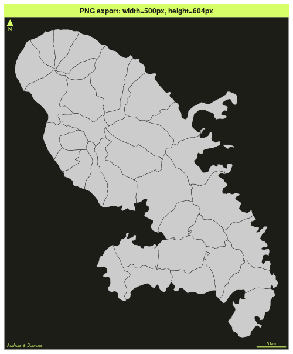
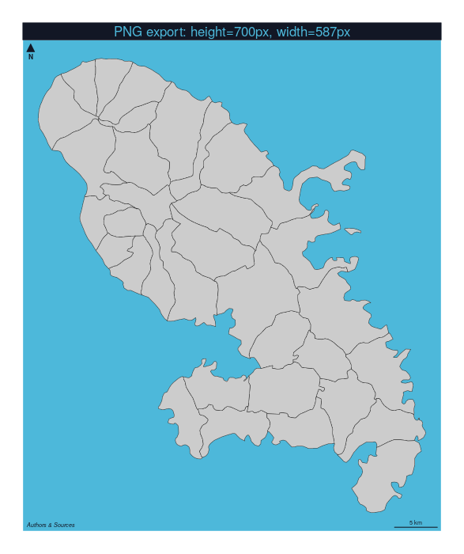
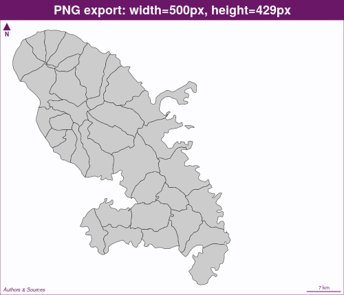
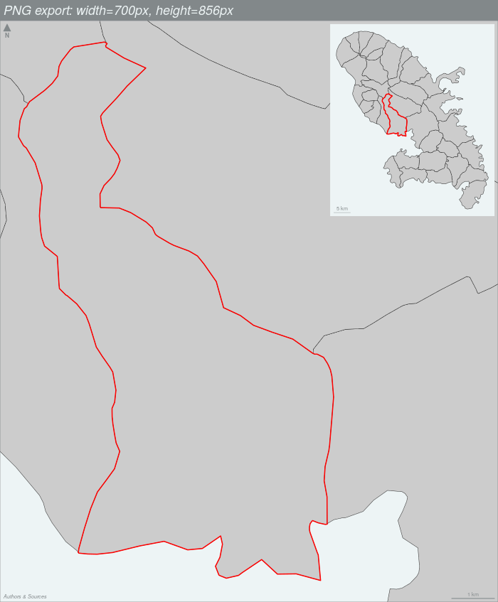

mf_init() is used to initiate a map. It plots x as an invisible layer. 

```{r}
library(mapsf)
mtq <- mf_get_mtq()
mf_init(x = mtq)
mf_map(mtq, add = TRUE)
```


mf_init() can be used to set a theme. 

```{r}
mf_init(x = mtq, theme = "barcelona")
mf_map(mtq, add = TRUE)
mf_layout()
```


mf_init() can be used to extend the map space on one or several side of the figure. 

```{r}
# extend the map space on the left (50% of x width) 
mf_init(x = mtq, expandBB = c(0,0.5,0,0), theme = "dark")
mf_map(mtq, add = TRUE)
mf_layout()
```


mf_init() can be used to center a map on a specific area.  

```{r}
# Extract Fort-de-France municipality
fdf <- mtq[9,]
mf_init(x = fdf, theme = "iceberg")
mf_map(mtq, add = TRUE)
mf_map(fdf, col = NA, border = "red", lwd = 2, add = TRUE)
mf_layout()
```


mf_init() can be used to export maps in PNG or SVG. 
The idea is to export a figure that have the same width/height ratio of a spatial object, taking into account margins and title. 
If width is specified, then height is deducted from the width/height ratio of x, figure margins and title size.
If height is specified, then width is deducted from the width/height ratio of x, figure margins and title size.


```{r, results="hide"}
mf_init(x = mtq, theme = "green",
        export = "png", filename = "fixed_width.png",
        width = 500)
mf_map(mtq, add = TRUE)
mf_layout(title = "PNG export: width=500px, height=604px")
dev.off()
```



```{r, results="hide"}
mf_init(x = mtq, theme = "nevermind", export = "png", 
        filename = "fixed_height.png", 
        height = 700)
mf_map(mtq, add = TRUE)
mf_layout(title = "PNG export: height=700px, width=587px")
dev.off()
```


Of course, if expandBB is used, the ratio of the figure is adapted to its value. 
```{r, results="hide"}
mf_init(x = mtq, theme = "candy", expandBB = c(0,0,0,.5),
        export = "png", filename = "fixed_width_expand.png",
        width = 500)
mf_map(mtq, add = TRUE)
mf_layout(title = "PNG export: width=500px, height=429px", 
          frame = TRUE)
dev.off()
```



You can combine all these parameters.


```{r, results="hide"}
mf_init(x = fdf, theme = "agolalight", expandBB = c(0,0,0,.5),
        export = "png", filename = "fixed_width_expand_target.png",
        width = 700)
mf_map(mtq, add = TRUE)
mf_map(fdf, col = NA, border = "red", lwd = 2, add = TRUE)
mf_inset_on(x = mtq, pos = "topright", cex = .33)
mf_map(mtq)
mf_map(fdf, col = NA, border = "red", lwd = 2, add = TRUE)
mf_scale(size = 5, pos = "bottomleft", cex = .6, lwd = .5)
mf_inset_off()
mf_layout(title = "PNG export: width=700px, height=856px", 
          frame = TRUE)
dev.off()
```



